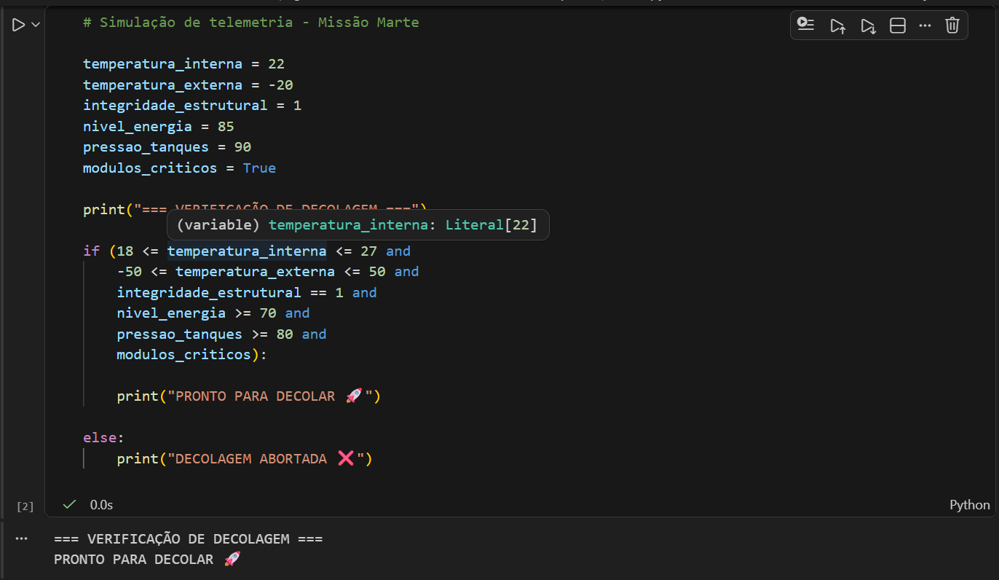

# 🚀 Missão Espacial para Marte

Este projeto simula um sistema de verificação de condições para decolagem de uma nave espacial com destino a Marte.

## 📊 Funcionalidades

- Análise de telemetria
- Verificação de condições de segurança
- Decisão automática de decolagem
- Simulação em Python

## 🧠 Tecnologias utilizadas

- Python
- Jupyter Notebook

## ▶️ Como executar

1. Abra o arquivo `missao_marte.ipynb`
2. Execute as células em ordem
3. Verifique o resultado da análise

## 📸 Exemplo de execução

## 📁 Estrutura do projeto

## 👨‍💻 Autor

Projeto desenvolvido para atividade acadêmica.
